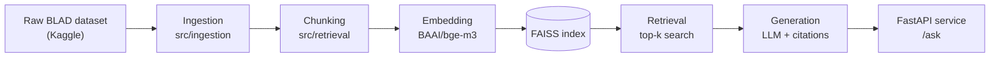

# bd-law-rag

[](LICENSE)
[](https://www.python.org/)
[](https://docs.astral.sh/uv/)

**Bangla and English question answering over Bangladeshi law.**

Answers cite the exact Act and section, the service refuses when the law
does not cover the question, and the pipeline is monitored for retrieval
quality, latency, and cost.

This is an end-to-end RAG (Retrieval-Augmented Generation) system built as
a portfolio project — from raw legal text to a served, monitored API.

---

## Table of contents

- [How it works](#how-it-works)
- [Status](#status)
- [Setup](#setup)
- [Project structure](#project-structure)
- [Reproducing the data](#reproducing-the-data)
- [Tech stack](#tech-stack)
- [Data](#data)
- [License](#license)

---

## How it works



A user question (Bangla or English) is embedded with the same multilingual
model used to index the corpus, matched against the FAISS index for the
most relevant sections, then passed to an LLM that drafts an answer citing
the exact Act and section — or declines if nothing in the pilot corpus is
actually relevant.

**Pilot scope:** 30 acts (12 Bengali, 18 English) · ~3,691 sections ·
~3,920 retrieval chunks. Acts span the Penal Code and Contract Act, 1872
through modern statutes like the Digital-era Customs Act, 2023, so the
pipeline is tested on both archaic English legal drafting and contemporary
Bangla.

---

## Status

| Stage                                                        | Status     |
| ------------------------------------------------------------ | ---------- |
| Project setup — tooling, config, pre-commit                  | ✅ Done    |
| Data ingestion — clean and validate the raw BLAD dataset     | ✅ Done    |
| Pilot act selection — 30 acts locked                         | ✅ Done    |
| Chunking — split sections into retrieval-sized chunks        | ✅ Done    |
| Embeddings and a searchable vector index                     | ✅ Done    |
| Hand-written test set and retrieval metrics (recall@k, MRR)  | ⬜ Next    |
| Answer generation with an LLM, citations, refusal path       | ⬜ Planned |
| FastAPI service (`/health`, `/ask`)                          | ⬜ Planned |
| Docker and docker-compose                                    | ⬜ Planned |
| CI/CD (GitHub Actions) with an evaluation gate                | ⬜ Planned |
| Deployment with a public URL                                 | ⬜ Planned |
| Monitoring (Prometheus/Grafana) and a drift simulation        | ⬜ Planned |

---

## Setup

```bash
git clone https://github.com/Kaniz-Reza/bd-law-rag.git
cd bd-law-rag
uv venv --python 3.11
source .venv/Scripts/activate   # Windows Git Bash; use `source .venv/bin/activate` on macOS/Linux
make setup
pre-commit install
```

---

## Project structure

```
src/
  ingestion/   # download, clean and validate the raw legal text
  retrieval/   # chunking, embeddings, and search over the chunks
  generation/  # LLM prompting and answer generation
  evaluation/  # retrieval and answer-quality metrics
  serving/     # the FastAPI service
  monitoring/  # latency, cost, and drift metrics
configs/       # config.yaml: pilot acts, chunking, retrieval, and LLM settings
tests/         # unit tests for each module
```

---

## Reproducing the data

The `data/` folder is not committed to this repo (see `.gitignore`), since
it holds a ~60 MB dataset plus several generated files. To rebuild it:

1. Download the [Bangladesh Legal Acts Dataset](https://www.kaggle.com/datasets/sakhadib/bangladesh-legal-acts-dataset)
   from Kaggle and unzip it into `data/raw/`.
2. Run the pipeline, in order:

```bash
python -m src.ingestion.load     # -> data/processed/acts.jsonl, sections.jsonl
python -m src.retrieval.chunk    # -> data/processed/chunks.jsonl
python -m src.retrieval.embed    # -> data/processed/embeddings.faiss, chunk_ids.json
```

3. (Optional) Sanity-check retrieval on a few sample questions:

```bash
python -m src.retrieval.search_test
```

> **Note:** `embed.py` downloads the `BAAI/bge-m3` model (~4.3 GB) on first
> run and embeds all chunks on CPU, which takes roughly 1.5–2.5 hours
> depending on hardware. Subsequent runs reuse the cached model.

---

## Tech stack

- **Language / tooling:** Python 3.11, [uv](https://docs.astral.sh/uv/) for dependency management, pre-commit hooks
- **Embeddings:** [`BAAI/bge-m3`](https://huggingface.co/BAAI/bge-m3) (multilingual, via `sentence-transformers`)
- **Vector search:** FAISS (flat, inner-product / cosine similarity)
- **Generation:** LLM-based answer synthesis with citations *(planned)*
- **Serving:** FastAPI *(planned)*
- **Ops:** Docker, GitHub Actions CI/CD, Prometheus/Grafana monitoring *(planned)*

---

## Data

**Source:** [Bangladesh Legal Acts Dataset (BLAD)](https://www.kaggle.com/datasets/sakhadib/bangladesh-legal-acts-dataset)
by Adib Sakhawat, licensed [CC BY-SA 4.0](https://creativecommons.org/licenses/by-sa/4.0/).

The full BLAD corpus covers 1,484 acts from 1799–2025 in English, Bengali,
and mixed-language text. This project works from a locked 30-act pilot
subset (see [Status](#status)) to keep iteration fast while the pipeline
is being built out; the same code is designed to scale to the full corpus
later.

---

## License

[MIT](LICENSE)
