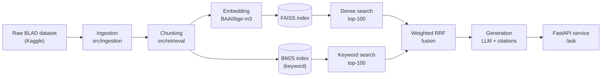

# bd-law-rag

[](LICENSE)
[](https://www.python.org/)
[](https://docs.astral.sh/uv/)

**Bangla and English question answering over Bangladeshi law.**

Answers cite the exact Act and section, the service refuses when the
law does not cover the question, and retrieval quality is evaluated
against a held-out test set.

This is an end-to-end RAG (Retrieval-Augmented Generation) system built as
a portfolio project — from raw legal text to a served, monitored API.

---

## Table of contents

- [How it works](#how-it-works)
- [Status](#status)
- [Setup](#setup)
- [Project structure](#project-structure)
- [Reproducing the data](#reproducing-the-data)
- [Usage](#usage)
- [Retrieval evaluation](#retrieval-evaluation)
- [Generation and refusal path](#generation-and-refusal-path)
- [Tech stack](#tech-stack)
- [Data](#data)
- [License](#license)

---

## How it works


```mermaid
flowchart LR
    A["Raw BLAD dataset<br/>(Kaggle)"] --> B["Ingestion<br/>src/ingestion"]
    B --> C["Chunking<br/>src/retrieval"]
    C --> D["Embedding<br/>BAAI/bge-m3"]
    D --> E[("FAISS index")]
    C --> BM[("BM25 index<br/>(keyword)")]
    E --> F1["Dense search<br/>top-100"]
    BM --> F2["Keyword search<br/>top-100"]
    F1 --> RRF["Weighted RRF<br/>fusion"]
    F2 --> RRF
    RRF --> G["Generation<br/>LLM + citations"]
    G --> H["FastAPI service<br/>/ask"]
```

A user question (Bangla or English) is embedded with the same multilingual
model used to index the corpus, then matched against the corpus with
**hybrid retrieval** — dense FAISS search plus BM25 keyword search,
combined by weighted Reciprocal Rank Fusion (see
[Retrieval evaluation](#retrieval-evaluation) for why) — and the fused
top chunks are passed to an LLM that drafts an answer citing the exact
Act and section, or declines if nothing in the pilot corpus is actually
relevant.

**Pilot scope:** 30 acts (12 Bengali, 18 English) · ~3,691 sections ·
~3,920 retrieval chunks. Acts span the Penal Code and Contract Act, 1872
through modern statutes like the Digital-era Customs Act, 2023, so the
pipeline is tested on both archaic English legal drafting and contemporary
Bangla.

---

## Status

| Stage                                                        | Status     |
| ------------------------------------------------------------ | ---------- |
| Project setup — tooling, config, pre-commit                  | ✅ Done    |
| Data ingestion — clean and validate the raw BLAD dataset     | ✅ Done    |
| Pilot act selection — 30 acts locked                         | ✅ Done    |
| Chunking — split sections into retrieval-sized chunks        | ✅ Done    |
| Embeddings and a searchable vector index                     | ✅ Done    |
| Hand-written test set and retrieval metrics (recall@k, MRR)  | ✅ Done    |
| Answer generation with an LLM, citations, refusal path       | ✅ Done    |
| FastAPI service (`/health`, `/ask`)                          | ✅ Done    |
| Docker and docker-compose                                    | ✅ Done    |
| CI/CD (GitHub Actions) with an evaluation gate                | ⬜ Planned |
| Deployment with a public URL                                 | ⬜ Planned |
| Monitoring (Prometheus/Grafana) and a drift simulation        | ⬜ Planned |

---

## Setup

```bash
git clone https://github.com/Kaniz-Reza/bd-law-rag.git
cd bd-law-rag
uv venv --python 3.11
source .venv/Scripts/activate   # Windows Git Bash; use `source .venv/bin/activate` on macOS/Linux
make setup
pre-commit install
```

Answer generation calls the Gemini API (free tier — no cost, no credit
card). Copy `.env.example` to `.env` and set `GEMINI_API_KEY` to a key
from [aistudio.google.com/app/apikey](https://aistudio.google.com/app/apikey).

---

## Project structure

```
src/
  ingestion/   # download, clean and validate the raw legal text
  retrieval/   # chunking, embeddings, and search over the chunks
  generation/  # LLM prompting and answer generation
  evaluation/  # retrieval and answer-quality metrics
  serving/     # the FastAPI service
  monitoring/  # latency, cost, and drift metrics
configs/       # config.yaml: pilot acts, chunking, retrieval, and LLM settings
tests/         # unit tests for each module
```

---

## Reproducing the data

The `data/` folder is not committed to this repo (see `.gitignore`), since
it holds a ~60 MB dataset plus several generated files. To rebuild it:

1. Download the [Bangladesh Legal Acts Dataset](https://www.kaggle.com/datasets/sakhadib/bangladesh-legal-acts-dataset)
   from Kaggle and unzip it into `data/raw/`.
2. Run the pipeline, in order:

```bash
python -m src.ingestion.load     # -> data/processed/acts.jsonl, sections.jsonl
python -m src.retrieval.chunk    # -> data/processed/chunks.jsonl
python -m src.retrieval.embed    # -> data/processed/embeddings.faiss, chunk_ids.json
```

3. (Optional) Sanity-check retrieval on a few sample questions:

```bash
python -m src.retrieval.search_test
```

> **Note:** `embed.py` downloads the `BAAI/bge-m3` model (~4.3 GB) on first
> run and embeds all chunks on CPU, which takes roughly 1.5–2.5 hours
> depending on hardware. Subsequent runs reuse the cached model.

4. (Optional) Run the retrieval evaluation suite:

```bash
python -m src.evaluation.resolve_chunk_ids   # fills in chunk_ids in test_set.json
python -m src.evaluation.evaluate            # -> plain FAISS Recall@k, MRR
python -m src.evaluation.evaluate_hybrid     # -> hybrid (FAISS+BM25) Recall@k, MRR
```

---

## Usage

Once the data is built and `GEMINI_API_KEY` is set (see [Setup](#setup)),
ask a question directly from the command line:

```bash
python -m src.generation.generate "চুরি করলে সর্বোচ্চ কত বছর জেল হতে পারে?"
```

The answer is generated only from retrieved chunks, cites the Act and
section for every claim, and declines instead of guessing when the
corpus doesn't cover the question — see
[Generation and refusal path](#generation-and-refusal-path).

### Running the API

The same pipeline is also served over HTTP with FastAPI, containerized
with Docker so it runs the same way on any machine:

```bash
docker compose up --build
```

This builds the image, starts the service on `http://localhost:8000`,
and persists the downloaded embedding model in a named volume so it
isn't re-downloaded on every restart. Interactive API docs are at
`http://localhost:8000/docs`.

```bash
curl -X POST http://localhost:8000/ask \
  -H "Content-Type: application/json" \
  -d '{"question": "চুরি করলে সর্বোচ্চ কত বছর জেল হতে পারে?"}'
```

`GET /health` returns a plain liveness check; `POST /ask` returns the
generated answer together with the Act/section of every source chunk
used.

---

## Retrieval evaluation

### Baseline: plain FAISS

Retrieval quality was first measured against a hand-written 38-question
test set, spanning 25 of the 30 pilot acts in both Bangla and English,
including cross-lingual questions (asked in one language, answered by a
chunk written in the other). Correct chunks were resolved against the real
corpus by act and section (`src/evaluation/resolve_chunk_ids.py`) rather
than guessed, so every answer key was verified to actually exist before
evaluation ran.

| Metric    | Score |
| --------- | ----- |
| Recall@1  | 0.553 |
| Recall@3  | 0.842 |
| Recall@5  | 0.921 |
| Recall@10 | 0.921 |
| Recall@20 | 0.921 |
| Recall@30 | 0.974 |
| Recall@50 | 1.000 |
| MRR       | 0.704 |

**Known limitation.** Three of the 38 questions failed to retrieve their
answer within the top 10; every correct chunk was present by rank 50,
indicating a ranking problem rather than a comprehension failure. Two
patterns accounted for most of it: large, vocabulary-dense acts (e.g.
কোম্পানী আইন, ১৯৯৪ at 471 chunks) dominate the similarity ranking for
questions that happen to share common legal terms such as "registration,"
even when the correct answer lies elsewhere; and acts with many topically
similar sections (e.g. the CPC's court-jurisdiction provisions) make it
difficult to rank the single correct section above its close neighbours.

**Evaluated and set aside — cross-encoder reranking.** Adding a
`BAAI/bge-reranker-v2-m3` reranking stage over the FAISS top-50
(`src/evaluation/evaluate_rerank.py`) improved Recall@1 (0.553 → 0.632)
and MRR (0.704 → 0.733), but left Recall@5/10 unchanged: one previously
failing question was resolved while a different one newly failed, for no
net change in the failure count. At approximately 70 seconds per question
on CPU, versus sub-second latency for plain FAISS retrieval, the added
cost is not currently justified by the gain, so reranking is not part of
the default pipeline. It remains a documented option to revisit with GPU
inference or a lighter-weight reranker.

### A specific failure: hybrid search (FAISS + BM25)

One of the three questions failing in the 38-question set asked about the
punishment for **theft** — a common legal term any retriever should
handle easily. A closer look showed the correct chunk (The Penal Code,
1860, section 379) was ranked **66th out of 3,920 chunks** by plain
FAISS: not missing, just buried. Dense embedding similarity treats
"theft" as semantically close to dozens of other property-crime sections,
and nothing in a pure embedding search boosts an exact keyword match.

This is a textbook case for combining dense (FAISS) and sparse/keyword
(BM25) retrieval. `src/retrieval/hybrid_search.py` runs both searches
independently and combines their rankings with **Reciprocal Rank Fusion
(RRF)**: each chunk's score is the sum of `1 / (k + rank)` across every
list it appears in.

An unweighted (50/50) fusion was tried first and made *every* metric
worse (Recall@1 0.553 → 0.289, MRR 0.704 → 0.448): most legal questions
use common, generic legal vocabulary with no rare keyword for BM25 to
lock onto, so BM25's noisier ranking was outvoting FAISS's otherwise-good
one. Weighting the fusion to trust FAISS more, and let BM25 only nudge
the result instead of splitting the vote evenly, fixed this. At
**FAISS weight 0.85 / BM25 weight 0.15**, the theft chunk moved from
rank 66 to **rank 1**, and overall metrics on the same 38 questions
recovered to close to the plain-FAISS baseline.

**Checking for overfitting.** Those weights were chosen by tuning
against the same 38 questions used for the baseline above — which shows
the fix works on that set, but says nothing about whether it generalizes.
To check, the test set was rebuilt from scratch: 60 new questions
(`ts-01`–`ts-60`), sampled from chunks never used in the original 38,
covering all 30 pilot acts, and never touched during weight tuning.
`src/evaluation/test_set.json` now holds only this held-out set — the
original 38 were retired once the new set confirmed the weights held up,
so the table above no longer reproduces by running `evaluate.py` today;
the table below does.

| Metric    | Plain FAISS | Hybrid (0.85 / 0.15) |
| --------- | ----------- | --------------------- |
| Recall@1  | 0.750       | 0.750                 |
| Recall@3  | 0.867       | 0.883                 |
| Recall@5  | 0.900       | 0.900                 |
| Recall@10 | 0.950       | 0.950                 |
| MRR       | 0.818       | 0.819                 |

*(Hybrid also reaches Recall@20 = 0.983, Recall@30 = 0.983, and
Recall@50 = 1.000 on this set; `evaluate.py` doesn't report those
higher-k values for plain FAISS.)*

On 60 genuinely held-out questions, hybrid retrieval is statistically
tied with plain FAISS — three questions (`ts-14`, `ts-26`, `ts-60`) miss
the top 10 under both retrievers, the same ranking-not-comprehension
pattern as the original baseline. This is not a general improvement, but
it isn't a regression either, and combined with the theft-style fix
demonstrated above, it's why hybrid search — not plain FAISS — is what
`src/generation/generate.py` uses in production
(`FAISS_CANDIDATES=100, BM25_CANDIDATES=100, FAISS_WEIGHT=0.85,
BM25_WEIGHT=0.15, TOP_K=10`): it costs nothing measurable on ordinary
questions while closing a real, demonstrated failure mode on
rare-keyword ones.

---

## Generation and refusal path

`src/generation/generate.py` retrieves with the hybrid search above,
assembles the fused top-10 chunks into a labelled prompt, and asks
Gemini (free tier) to answer using only that context — citing the Act
and section for every claim, and declining outright if the retrieved
context doesn't actually cover the question.

Spot-checked manually:

- **Grounded answer + citations.** Asked the theft question above; the
  answer cited sections 379–382 with the correct penalty for each,
  verified word-for-word against the source chunks (not just
  plausible-sounding text), and correctly identified section 382
  (10 years, *rigorous* imprisonment) as the actual maximum — not
  section 379 (3 years) alone.
- **Refusal path.** Asked two questions clearly outside the 30-act
  pilot corpus (income tax return deadlines; which constitutional
  article covers fundamental rights). Both times, despite FAISS/BM25
  still returning 10 tangentially-related chunks (retrieval always
  returns *something*), the model correctly stated the provided acts
  don't cover the question instead of guessing from the nearest
  available chunk.

This is manual spot-checking, not an automated benchmark — a natural
next step would be a small labelled set of in-corpus vs. out-of-corpus
questions to track this with a metric instead of a few examples.

---

## Tech stack

- **Language / tooling:** Python 3.11, [uv](https://docs.astral.sh/uv/) for dependency management, pre-commit hooks
- **Embeddings:** [`BAAI/bge-m3`](https://huggingface.co/BAAI/bge-m3) (multilingual, via `sentence-transformers`)
- **Retrieval:** FAISS (flat, inner-product / cosine similarity) for dense search, [`rank_bm25`](https://github.com/dorianbrown/rank_bm25) for keyword search, combined via weighted Reciprocal Rank Fusion
- **Generation:** Gemini API (free tier) — answer synthesis with citations and a refusal path
- **Serving:** FastAPI, served with Uvicorn — `/health` and `/ask` endpoints
- **Ops:** Docker and docker-compose for containerized serving; GitHub Actions CI/CD and Prometheus/Grafana monitoring *(planned)*

---

## Data

**Source:** [Bangladesh Legal Acts Dataset (BLAD)](https://www.kaggle.com/datasets/sakhadib/bangladesh-legal-acts-dataset)
by Adib Sakhawat, licensed [CC BY-SA 4.0](https://creativecommons.org/licenses/by-sa/4.0/).

The full BLAD corpus covers 1,484 acts from 1799–2025 in English, Bengali,
and mixed-language text. This project works from a locked 30-act pilot
subset (see [Status](#status)) to keep iteration fast while the pipeline
is being built out; the same code is designed to scale to the full corpus
later.

---

## License

[MIT](LICENSE)
