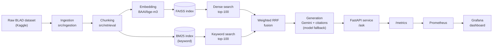
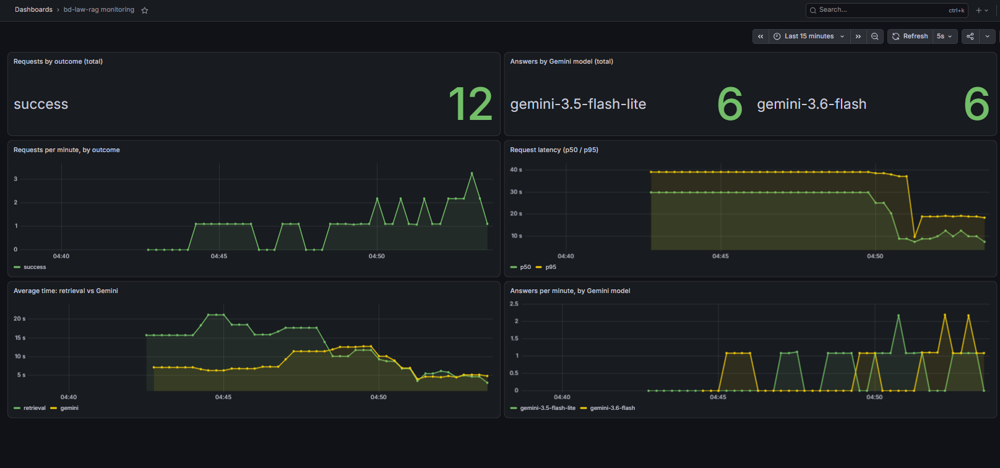

# bd-law-rag

[](https://github.com/Kaniz-Reza/bd-law-rag/actions/workflows/ci.yml)
[](LICENSE)
[](https://www.python.org/)
[](https://docs.astral.sh/uv/)

**Bangla and English question answering over Bangladeshi law.**

Answers cite the exact Act and section, the service refuses when the
law does not cover the question, and retrieval quality is evaluated
against a held-out test set.

This is an end-to-end RAG (Retrieval-Augmented Generation) system built as
a portfolio project — from raw legal text to a served, monitored API.

---

## Table of contents

- [How it works](#how-it-works)
- [Status](#status)
- [Setup](#setup)
- [Project structure](#project-structure)
- [Reproducing the data](#reproducing-the-data)
- [Usage](#usage)
- [Monitoring](#monitoring)
- [Retrieval evaluation](#retrieval-evaluation)
- [Generation and refusal path](#generation-and-refusal-path)
- [Handling Gemini overload and quota](#handling-gemini-overload-and-quota)
- [CI](#ci)
- [Tech stack](#tech-stack)
- [Data](#data)
- [License](#license)

---

## How it works


```mermaid
flowchart LR
    A["Raw BLAD dataset<br/>(Kaggle)"] --> B["Ingestion<br/>src/ingestion"]
    B --> C["Chunking<br/>src/retrieval"]
    C --> D["Embedding<br/>BAAI/bge-m3"]
    D --> E[("FAISS index")]
    C --> BM[("BM25 index<br/>(keyword)")]
    E --> F1["Dense search<br/>top-100"]
    BM --> F2["Keyword search<br/>top-100"]
    F1 --> RRF["Weighted RRF<br/>fusion"]
    F2 --> RRF
    RRF --> G["Generation<br/>Gemini + citations<br/>(model fallback)"]
    G --> H["FastAPI service<br/>/ask"]
    H --> M["/metrics"]
    M --> P["Prometheus"]
    P --> GR["Grafana<br/>dashboard"]
```

A user question (Bangla or English) is embedded with the same multilingual
model used to index the corpus, then matched against the corpus with
**hybrid retrieval** — dense FAISS search plus BM25 keyword search,
combined by weighted Reciprocal Rank Fusion (see
[Retrieval evaluation](#retrieval-evaluation) for why) — and the fused
top chunks are passed to an LLM that drafts an answer citing the exact
Act and section, or declines if nothing in the pilot corpus is actually
relevant.

**Pilot scope:** 30 acts (12 Bengali, 18 English) · ~3,691 sections ·
~3,920 retrieval chunks. Acts span the Penal Code and Contract Act, 1872
through modern statutes like the Customs Act, 2023, so the
pipeline is tested on both archaic English legal drafting and contemporary
Bangla.

---

## Status

| Stage                                                        | Status     |
| ------------------------------------------------------------ | ---------- |
| Project setup — tooling, config, pre-commit                  | ✅ Done    |
| Data ingestion — clean and validate the raw BLAD dataset     | ✅ Done    |
| Pilot act selection — 30 acts locked                         | ✅ Done    |
| Chunking — split sections into retrieval-sized chunks        | ✅ Done    |
| Embeddings and a searchable vector index                     | ✅ Done    |
| Hand-written test set and retrieval metrics (recall@k, MRR)  | ✅ Done    |
| Answer generation with an LLM, citations, refusal path       | ✅ Done    |
| Gemini model fallback for overload (503) and quota (429)     | ✅ Done    |
| FastAPI service (`/health`, `/ask`, `/metrics`)              | ✅ Done    |
| Docker and docker-compose                                    | ✅ Done    |
| CI (GitHub Actions): lint, tests, retrieval evaluation gate  | ✅ Done    |
| Monitoring: Prometheus and a Grafana dashboard               | ✅ Done    |
| Drift simulation                                             | ⬜ Planned |
| Deployment with a public URL                                 | ⬜ Planned |

---

## Setup

```bash
git clone https://github.com/Kaniz-Reza/bd-law-rag.git
cd bd-law-rag
uv venv --python 3.11
source .venv/Scripts/activate   # Windows Git Bash; use `source .venv/bin/activate` on macOS/Linux
make setup
pre-commit install
```

Answer generation calls the Gemini API (free tier — no cost, no credit
card). Copy `.env.example` to `.env` and set `GEMINI_API_KEY` to a key
from [aistudio.google.com/app/apikey](https://aistudio.google.com/app/apikey).

To run the API with the monitoring dashboard (see [Usage](#usage)) you
also need Docker.

---

## Project structure

```
src/
  ingestion/   # download, clean and validate the raw legal text
  retrieval/   # chunking, embeddings, and search over the chunks
  generation/  # LLM prompting, answer generation, Gemini model fallback
  evaluation/  # retrieval and answer-quality metrics
  serving/     # the FastAPI service (/health, /ask, /metrics)
  monitoring/  # reserved for drift-monitoring code (not written yet)
monitoring/    # Prometheus and Grafana config, used by docker-compose
configs/       # config.yaml: pilot acts, chunking, retrieval, and LLM settings
tests/         # unit tests
.github/       # CI workflow
Dockerfile, docker-compose.yml
```

---

## Reproducing the data

The raw dataset (`data/raw/`, ~60 MB) is not committed to this repo (see
`.gitignore`). The processed files the API needs at startup —
`data/processed/chunks.jsonl`, `chunk_ids.json` and `embeddings.faiss` —
**are** committed, so the API and the Docker image work right after
cloning. To rebuild everything from scratch:

1. Download the [Bangladesh Legal Acts Dataset](https://www.kaggle.com/datasets/sakhadib/bangladesh-legal-acts-dataset)
   from Kaggle and unzip it into `data/raw/`.
2. Run the pipeline, in order:

```bash
python -m src.ingestion.load     # -> data/processed/acts.jsonl, sections.jsonl
python -m src.retrieval.chunk    # -> data/processed/chunks.jsonl
python -m src.retrieval.embed    # -> data/processed/embeddings.faiss, chunk_ids.json
```

3. (Optional) Sanity-check retrieval on a few sample questions:

```bash
python -m src.retrieval.search_test
```

> **Note:** `embed.py` downloads the `BAAI/bge-m3` model (~4.3 GB) on first
> run and embeds all chunks on CPU, which takes roughly 1.5–2.5 hours
> depending on hardware. Subsequent runs reuse the cached model.

4. (Optional) Run the retrieval evaluation suite:

```bash
python -m src.evaluation.resolve_chunk_ids   # fills in chunk_ids in test_set.json
python -m src.evaluation.evaluate            # -> plain FAISS Recall@k, MRR
python -m src.evaluation.evaluate_hybrid     # -> hybrid (FAISS+BM25) Recall@k, MRR
```

---

## Usage

Once the data is built and `GEMINI_API_KEY` is set (see [Setup](#setup)),
ask a question directly from the command line:

```bash
python -m src.generation.generate "চুরি করলে সর্বোচ্চ কত বছর জেল হতে পারে?"
```

The answer is generated only from retrieved chunks, cites the Act and
section for every claim, and declines instead of guessing when the
corpus doesn't cover the question — see
[Generation and refusal path](#generation-and-refusal-path). The command
also prints which Gemini model produced the answer — see
[Handling Gemini overload and quota](#handling-gemini-overload-and-quota).

### Running the API with monitoring

The same pipeline is also served over HTTP with FastAPI, containerized
with Docker so it runs the same way on any machine. One command starts
the API together with Prometheus and Grafana:

```bash
docker compose up --build
```

| Service    | URL                           | What it does                                                        |
| ---------- | ----------------------------- | ------------------------------------------------------------------- |
| API        | http://localhost:8000/docs    | the RAG service (interactive docs)                                  |
| Prometheus | http://localhost:9090         | reads `/metrics` from the API every 5 seconds and stores the numbers |
| Grafana    | http://localhost:3000         | dashboard (user `admin`, password `admin` — for local use only)     |

The API reads `GEMINI_API_KEY` from `.env`. The downloaded embedding model
and the Grafana data are kept in named volumes, so they are not lost on
restart. Stop everything with `docker compose down`.

```bash
curl -X POST http://localhost:8000/ask \
  -H "Content-Type: application/json" \
  -d '{"question": "চুরি করলে সর্বোচ্চ কত বছর জেল হতে পারে?"}'
```

`GET /health` returns a plain liveness check; `POST /ask` returns the
generated answer together with the Act/section of every source chunk
used; `GET /metrics` is for Prometheus.

---

## Monitoring

The API exposes these metrics with `prometheus_client` at `GET /metrics`:

| Metric                        | What it measures                                                           |
| ----------------------------- | -------------------------------------------------------------------------- |
| `ask_requests_total{outcome}` | `/ask` requests, by outcome: `success`, `gemini_server_error`, `gemini_client_error` |
| `ask_latency_seconds`         | total time per `/ask` request                                              |
| `retrieval_latency_seconds`   | time spent in hybrid retrieval                                             |
| `llm_latency_seconds`         | time waiting for Gemini, including fallback attempts                       |
| `llm_model_used_total{model}` | which Gemini model produced the answer                                     |

Prometheus is configured in `monitoring/prometheus.yml`. Grafana loads
its data source and the **bd-law-rag monitoring** dashboard automatically
from the files under `monitoring/grafana/`, so nothing has to be clicked
together by hand. The dashboard has six panels:

- Requests by outcome (total)
- Answers by Gemini model (total)
- Requests per minute, by outcome
- Request latency (p50 / p95)
- Average retrieval time vs. Gemini time
- Answers per minute, by model



**Checked end to end.** In a local run through `docker compose`, 12
questions were sent to `/ask`. All 12 succeeded. The dashboard showed
`gemini-3.5-flash-lite` answering 6, `gemini-3.6-flash` answering 6 and
the first-choice `gemini-3.8-flash` answering none, so the fallback below
was doing the work.

A drift simulation, using the similarity score of the best-matching
chunk as the signal, is planned next.

---

## Retrieval evaluation

### Baseline: plain FAISS

Retrieval quality was first measured against a hand-written 38-question
test set, spanning 25 of the 30 pilot acts in both Bangla and English,
including cross-lingual questions (asked in one language, answered by a
chunk written in the other). Correct chunks were resolved against the real
corpus by act and section (`src/evaluation/resolve_chunk_ids.py`) rather
than guessed, so every answer key was verified to actually exist before
evaluation ran.

| Metric    | Score |
| --------- | ----- |
| Recall@1  | 0.553 |
| Recall@3  | 0.842 |
| Recall@5  | 0.921 |
| Recall@10 | 0.921 |
| Recall@20 | 0.921 |
| Recall@30 | 0.974 |
| Recall@50 | 1.000 |
| MRR       | 0.704 |

**Known limitation.** Three of the 38 questions failed to retrieve their
answer within the top 10; every correct chunk was present by rank 50,
indicating a ranking problem rather than a comprehension failure. Two
patterns accounted for most of it: large, vocabulary-dense acts (e.g.
কোম্পানী আইন, ১৯৯৪ at 471 chunks) dominate the similarity ranking for
questions that happen to share common legal terms such as "registration,"
even when the correct answer lies elsewhere; and acts with many topically
similar sections (e.g. the CPC's court-jurisdiction provisions) make it
difficult to rank the single correct section above its close neighbours.

**Evaluated and set aside — cross-encoder reranking.** Adding a
`BAAI/bge-reranker-v2-m3` reranking stage over the FAISS top-50
(`src/evaluation/evaluate_rerank.py`) improved Recall@1 (0.553 → 0.632)
and MRR (0.704 → 0.733), but left Recall@5/10 unchanged: one previously
failing question was resolved while a different one newly failed, for no
net change in the failure count. At approximately 70 seconds per question
on CPU, versus sub-second latency for plain FAISS retrieval, the added
cost is not currently justified by the gain, so reranking is not part of
the default pipeline. It remains a documented option to revisit with GPU
inference or a lighter-weight reranker.

### A specific failure: hybrid search (FAISS + BM25)

One of the three questions failing in the 38-question set asked about the
punishment for **theft** — a common legal term any retriever should
handle easily. A closer look showed the correct chunk (The Penal Code,
1860, section 379) was ranked **66th out of 3,920 chunks** by plain
FAISS: not missing, just buried. Dense embedding similarity treats
"theft" as semantically close to dozens of other property-crime sections,
and nothing in a pure embedding search boosts an exact keyword match.

This is a textbook case for combining dense (FAISS) and sparse/keyword
(BM25) retrieval. `src/retrieval/hybrid_search.py` runs both searches
independently and combines their rankings with **Reciprocal Rank Fusion
(RRF)**: each chunk's score is the sum of `1 / (k + rank)` across every
list it appears in.

An unweighted (50/50) fusion was tried first and made *every* metric
worse (Recall@1 0.553 → 0.289, MRR 0.704 → 0.448): most legal questions
use common, generic legal vocabulary with no rare keyword for BM25 to
lock onto, so BM25's noisier ranking was outvoting FAISS's otherwise-good
one. Weighting the fusion to trust FAISS more, and let BM25 only nudge
the result instead of splitting the vote evenly, fixed this. At
**FAISS weight 0.85 / BM25 weight 0.15**, the theft chunk moved from
rank 66 to **rank 1**, and overall metrics on the same 38 questions
recovered to close to the plain-FAISS baseline.

**Checking for overfitting.** Those weights were chosen by tuning
against the same 38 questions used for the baseline above — which shows
the fix works on that set, but says nothing about whether it generalizes.
To check, the test set was rebuilt from scratch: 60 new questions
(`ts-01`–`ts-60`), sampled from chunks never used in the original 38,
covering all 30 pilot acts, and never touched during weight tuning.
`src/evaluation/test_set.json` now holds only this held-out set — the
original 38 were retired once the new set confirmed the weights held up,
so the table above no longer reproduces by running `evaluate.py` today;
the table below does.

| Metric    | Plain FAISS | Hybrid (0.85 / 0.15) |
| --------- | ----------- | --------------------- |
| Recall@1  | 0.750       | 0.750                 |
| Recall@3  | 0.867       | 0.883                 |
| Recall@5  | 0.900       | 0.900                 |
| Recall@10 | 0.950       | 0.950                 |
| MRR       | 0.818       | 0.819                 |

*(Hybrid also reaches Recall@20 = 0.983, Recall@30 = 0.983, and
Recall@50 = 1.000 on this set; `evaluate.py` doesn't report those
higher-k values for plain FAISS.)*

On 60 genuinely held-out questions, hybrid retrieval is statistically
tied with plain FAISS — three questions (`ts-14`, `ts-26`, `ts-60`) miss
the top 10 under both retrievers, the same ranking-not-comprehension
pattern as the original baseline. This is not a general improvement, but
it isn't a regression either, and combined with the theft-style fix
demonstrated above, it's why hybrid search — not plain FAISS — is what
`src/generation/generate.py` uses in production
(`FAISS_CANDIDATES=100, BM25_CANDIDATES=100, FAISS_WEIGHT=0.85,
BM25_WEIGHT=0.15, TOP_K=10`): it costs nothing measurable on ordinary
questions while closing a real, demonstrated failure mode on
rare-keyword ones.

---

## Generation and refusal path

`src/generation/generate.py` retrieves with the hybrid search above,
assembles the fused top-10 chunks into a labelled prompt, and asks
Gemini (free tier) to answer using only that context — citing the Act
and section for every claim, and declining outright if the retrieved
context doesn't actually cover the question.

Spot-checked manually:

- **Grounded answer + citations.** Asked the theft question above; the
  answer cited sections 379–382 with the correct penalty for each,
  verified word-for-word against the source chunks (not just
  plausible-sounding text), and correctly identified section 382
  (10 years, *rigorous* imprisonment) as the actual maximum — not
  section 379 (3 years) alone.
- **Refusal path.** Asked two questions clearly outside the 30-act
  pilot corpus (income tax return deadlines; which constitutional
  article covers fundamental rights). Both times, despite FAISS/BM25
  still returning 10 tangentially-related chunks (retrieval always
  returns *something*), the model correctly stated the provided acts
  don't cover the question instead of guessing from the nearest
  available chunk.

This is manual spot-checking, not an automated benchmark — a natural
next step would be a small labelled set of in-corpus vs. out-of-corpus
questions to track this with a metric instead of a few examples.

**Checked again through the running API.** Answers were compared with
the text in the corpus:

- *Maternity leave:* 8 weeks before and 8 weeks after birth, only for a
  woman who worked for the employer for at least 6 months before the birth
  (Bangladesh Labour Act, 2006, sections 46–47).
- *Selling adulterated goods:* up to 3 years in prison, or a fine of up
  to 2 lakh taka, or both (Consumer Rights Protection Act, 2009,
  section 41).
- *Guardian of a minor:* the court decides by the welfare of the minor,
  and a minor who is a citizen of Bangladesh can only be given a guardian
  who is also a citizen (Guardians and Wards Act, 1890, sections 7, 17).
- *Outside the corpus:* "What is the capital of France?" got "the
  provided acts do not cover this question". For the minimum age for a
  driving licence, the answer said no specific age is given, and pointed
  to two related provisions that do exist in the corpus: a driver in a
  road transport establishment must be at least 21 (Labour Act,
  section 112(1)), and the birth certificate is the proof of age for a
  driving licence (Birth and Death Registration Act, 2004,
  section 18(3)).

**Known limitation.** When the answer says the question is not covered,
the `sources` list in the response can still show unrelated sections,
because retrieval always returns the top 10 chunks. Using the similarity
score of the best match to detect questions outside the corpus is a
possible fix.

---

## Handling Gemini overload and quota

The Gemini free tier sometimes returns a 503 (servers overloaded) or a
429 (quota used up). Both happen per model, so one busy model does not
mean the others are busy.

`call_llm()` in `src/generation/generate.py` tries these models in order
and moves to the next as soon as one fails:

1. `gemini-3.8-flash`
2. `gemini-3.6-flash`
3. `gemini-3.5-flash-lite`

If all three fail, `/ask` returns 503 (overloaded) or 429 (quota) with a
clear message. The model that answered is counted in
`llm_model_used_total{model}`, so the dashboard shows when the fallback
is being used. This replaced an earlier approach that retried
the same model up to 5 times, which could keep one request waiting for
about a minute. The fallback logic is unit-tested with a fake client
(`tests/test_llm_fallback.py`), so the tests need no real API key.

---

## CI

GitHub Actions (`.github/workflows/ci.yml`) runs on every push to `main`
and on every pull request:

1. Lint and format check with ruff
2. Unit tests with pytest
3. The retrieval evaluation (`evaluate_hybrid`) as a quality gate

The embedding model is cached between runs, so the evaluation step does
not download it every time.

---

## Tech stack

- **Language / tooling:** Python 3.11, [uv](https://docs.astral.sh/uv/) for dependency management, pre-commit hooks, ruff
- **Embeddings:** [`BAAI/bge-m3`](https://huggingface.co/BAAI/bge-m3) (multilingual, via `sentence-transformers`)
- **Retrieval:** FAISS (flat, inner-product / cosine similarity) for dense search, [`rank_bm25`](https://github.com/dorianbrown/rank_bm25) for keyword search, combined via weighted Reciprocal Rank Fusion
- **Generation:** Gemini API (free tier) — answer synthesis with citations and a refusal path, with fallback across three models
- **Serving:** FastAPI, served with Uvicorn — `/health`, `/ask` and `/metrics` endpoints
- **Ops:** Docker and docker-compose for containerized serving; GitHub Actions for CI
- **Monitoring:** `prometheus_client` metrics in the API, Prometheus and Grafana run by docker-compose

---

## Data

**Source:** [Bangladesh Legal Acts Dataset (BLAD)](https://www.kaggle.com/datasets/sakhadib/bangladesh-legal-acts-dataset)
by Adib Sakhawat, licensed [CC BY-SA 4.0](https://creativecommons.org/licenses/by-sa/4.0/).

The full BLAD corpus covers 1,484 acts from 1799–2025 in English, Bengali,
and mixed-language text. This project works from a locked 30-act pilot
subset (see [Status](#status)) to keep iteration fast while the pipeline
is being built out; the same code is designed to scale to the full corpus
later.

---

## License

[MIT](LICENSE)
